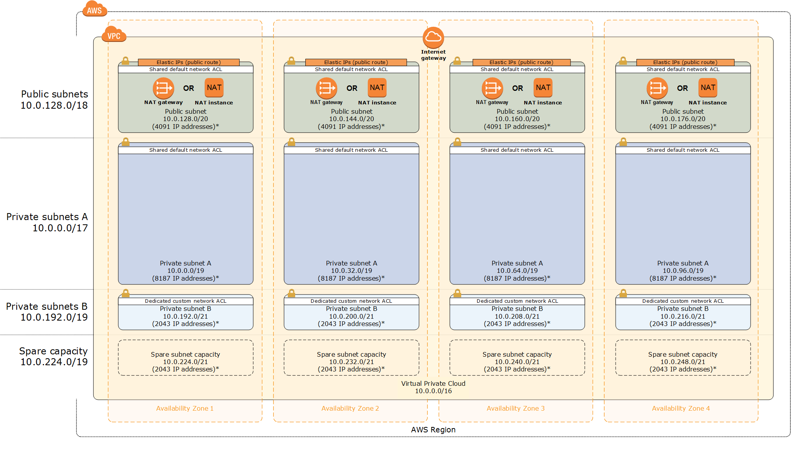

Deploying this Quick Start for a new virtual private cloud (VPC) with
*default parameters* builds the following _{partner-product-name}_ environment in the
AWS Cloud.

// Replace this example diagram with your own. Send us your source PowerPoint file. Be sure to follow our guidelines here : http://(we should include these points on our contributors giude)
[#architecture1]
.Quick Start architecture for _{partner-product-name}_ on AWS
[link=images/architecture_diagram.png]

NOTE: The IP addresses exclude five addresses from each subnet that are reserved and unavailable for use *

As shown in Figure 1, the Quick Start sets up the following:

The AWS CloudFormation template sets up the virtual network and creates networking
resources.

The template creates a Multi-AZ, multi-subnet VPC infrastructure with managed NAT
gateways in the public subnet for each Availability Zone. You can also create additional
private subnets with dedicated custom network access control lists (ACLs). If you deploy
the Quick Start in a region that doesn’t support NAT gateways, NAT instances are deployed
instead. Default subnet sizes are based on a typical deployment but can be reconfigured, as
discussed in the link:#_subnet_sizing[Subnet Sizing] section.

The Quick Start also includes VPC endpoints, which provide a secure, reliable connection to
Amazon S3 without requiring an Internet gateway, a NAT device, or a virtual private
gateway. With these endpoints, you can access S3 resources from within the VPC created by
the Quick Start. These endpoints are valid only for the AWS Region in which you launch the
Quick Start.

The Quick Start uses the default endpoint policy, which gives any user or service within the
VPC full access to Amazon S3 resources. This policy supplements any IAM user policies or
S3 bucket policies that you may have in place. 

The Quick Start also enables Domain Name System (DNS) resolution in the VPC. For more
information about VPC endpoints, see the https://docs.aws.amazon.com/vpc/latest/userguide/vpc-endpoints-s3.html[AWS documentation].